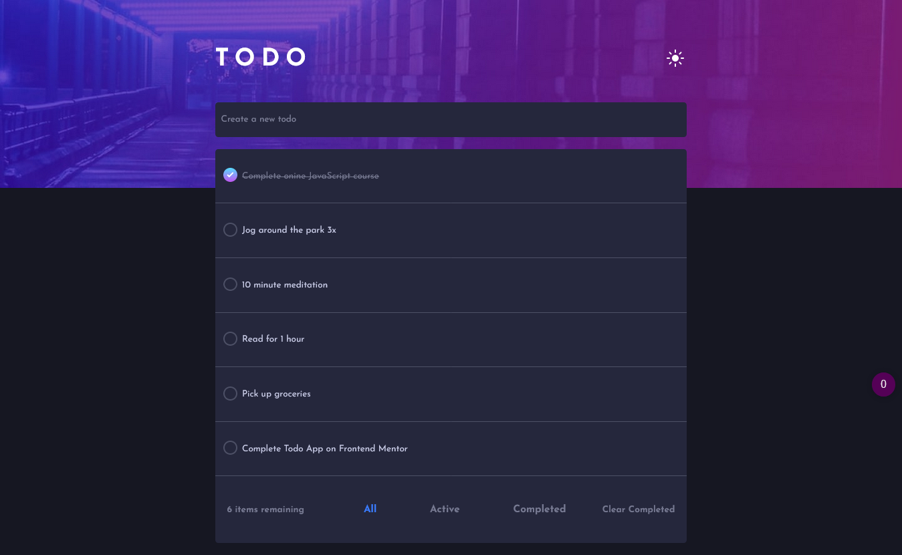

# Frontend Mentor - Todo app solution

This is a solution to the [Todo app challenge on Frontend Mentor](https://www.frontendmentor.io/challenges/todo-app-Su1_KokOW). Frontend Mentor challenges help you improve your coding skills by building realistic projects. 

## Table of contents

- [Overview](#overview)
  - [The challenge](#the-challenge)
  - [Screenshot](#screenshot)
  - [Links](#links)
- [My process](#my-process)
  - [Built with](#built-with)
  - [What I learned](#what-i-learned)
  - [Continued development](#continued-development)
- [Acknowledgments](#acknowledgments)

## Overview

### The challenge

Users should be able to:

- View the optimal layout for the app depending on their device's screen size
- See hover states for all interactive elements on the page
- Add new todos to the list
- Edit todos
- Mark todos as complete
- Delete todos from the list
- Filter by all/active/complete todos
- Clear all completed todos
- Toggle light and dark mode

### Screenshot

### Links

- Live Site URL: [Live site](https://gorgeous-pony-d2e0ae.netlify.app/)

## My process

### Built with

- Semantic HTML5 markup
- CSS custom properties
- Flexbox
- Mobile-first workflow
- [React](https://reactjs.org/) - JS library

### What I learned

This project allowed me to work with several important parts of React. These parts are hooks, namely useState, useEffect and useRef and conditional rendering. Apart from working with and learning React, I also learned how to implement a theme switcher use the HTML data attribute. 

### Continued development

In future React projects I'd like to work with different types of hooks and React libraries. 

## Acknowledgments

- [Article on CSS theme switch](https://dev.to/ananyaneogi/create-a-dark-light-mode-switch-with-css-variables-34l8) - This article provided a solution to creating a theme switcher with CSS and JS.
- [Article on CSS gradient borders](https://codyhouse.co/nuggets/css-gradient-borders) - This article provided a solution to creating a circular gradient border.
- [Solution for conditional React rendering](https://stackoverflow.com/questions/46586165/react-conditionally-render-based-on-viewport-size) - This provided a solution to conditional React rendering; in particular, in this project it was used to change the position of the filter buttons depending on the user's screen width.